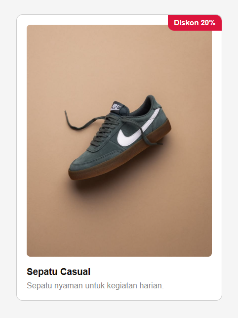
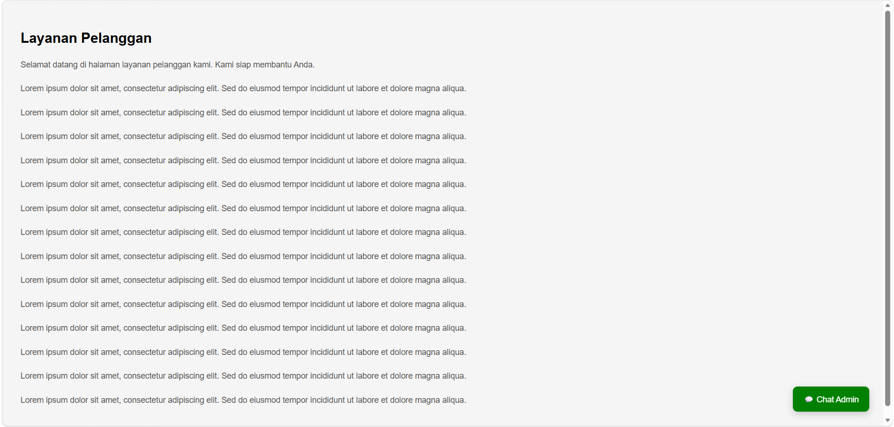
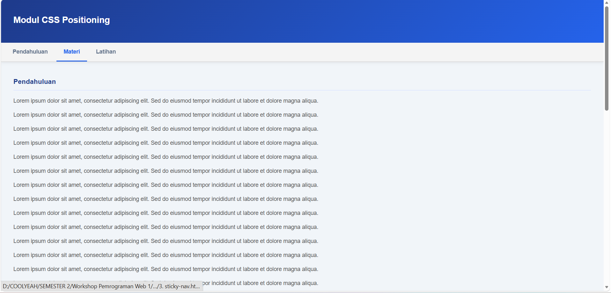
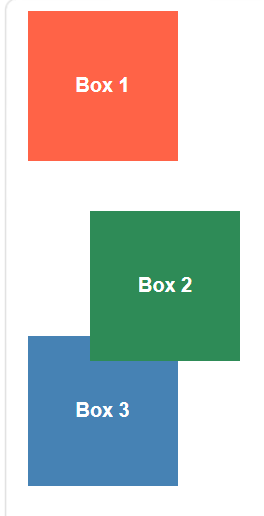
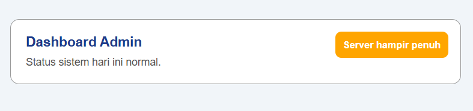
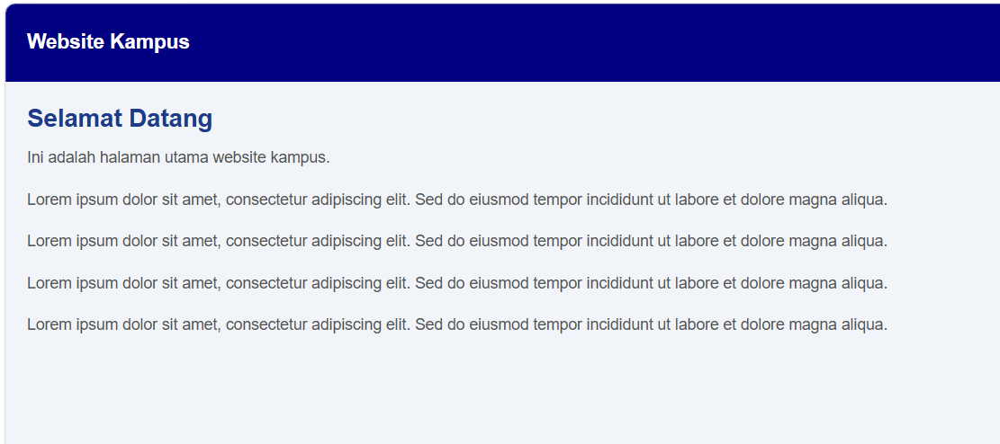
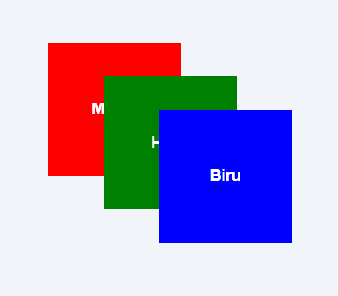
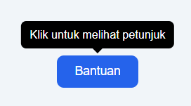
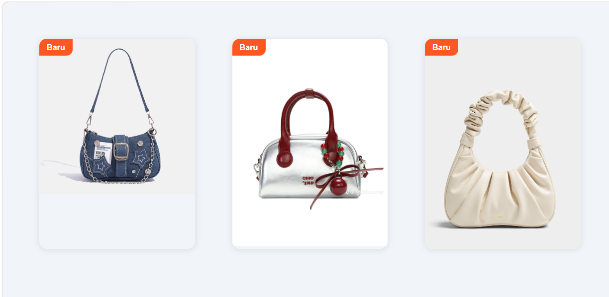

# CSS Positioning — Study Case

## 📋 Tentang Repository

Repository ini berisi kumpulan **10 study case CSS Positioning** yang dibuat berdasarkan skenario nyata pada tampilan website modern. Project ini disusun sebagai bagian dari tugas **Workshop Pemrograman Web 1** untuk memahami penerapan properti `position` dalam pengembangan antarmuka web.
Setiap file berisi contoh kasus yang berbeda, lengkap dengan implementasi HTML dan CSS.

---

## 🎯 Tujuan Pembelajaran

Melalui repository ini, materi yang dipelajari meliputi:

* Memahami perbedaan `static`, `relative`, `absolute`, `fixed`, dan `sticky`
* Menentukan penggunaan position sesuai kebutuhan layout
* Mengatur elemen agar menempel pada parent tertentu
* Menghindari masalah umum seperti konten tertutup header
* Membuat tampilan lebih interaktif menggunakan tooltip, badge, label, dan floating button

---

## 🗂️ Daftar Study Case

| No | File                         | Study Case                                   |
| -- | ---------------------------- | -------------------------------------------- |
| 1  | `soal1-badge.html`           | 🏷️ Badge Notifikasi di Pojok Kartu          |
| 2  | `soal2-chat.html`            | 💬 Tombol Chat yang Selalu Muncul            |
| 3  | `soal3-sticky-nav.html`      | 📌 Menu Navigasi Menempel Saat Scroll        |
| 4  | `soal4-relative-box.html`    | 🟩 Kotak Bergeser Tanpa Mengubah Posisi Awal |
| 5  | `soal5-logo-banner.html`     | 🖼️ Logo di Atas Banner                      |
| 6  | `soal6-dashboard-notif.html` | ⚠️ Notifikasi Mengambang di Dashboard        |
| 7  | `soal7-fixed-header.html`    | 🔒 Header Menutupi Konten                    |
| 8  | `soal8-tumpukan.html`        | 🃏 Menentukan Urutan Tumpukan Kotak          |
| 9  | `soal9-tooltip.html`         | 🫧 Tooltip Muncul di Atas Tombol             |
| 10 | `soal10-galeri.html`         | 🛍️ Galeri Produk dengan Label "Baru"        |

---

## 🧠 Ringkasan Konsep CSS Positioning

| Properti             | Fungsi                              |
| -------------------- | ----------------------------------- |
| `position: static`   | Posisi default elemen               |
| `position: relative` | Menggeser elemen dari posisi awal   |
| `position: absolute` | Posisi berdasarkan parent terdekat  |
| `position: fixed`    | Tetap di layar walau discroll       |
| `position: sticky`   | Menempel saat mencapai batas scroll |

---

## 📸 Screenshot
## Screenshot Soal 1


## Screenshot Soal 2


## Screenshot Soal 3


## Screenshot Soal 4


## Screenshot Soal 5


## Screenshot Soal 6


## Screenshot Soal 7


## Screenshot Soal 8


## Screenshot Soal 9


## Screenshot Soal 10

```

---

## 💻 Teknologi yang Digunakan

* HTML — Struktur dan konten halaman
* CSS — Positioning, transform, transisi, dan pseudo-element
* Visual Studio Code

---

## 📁 Struktur Folder

```bash
css-positioning-study-case/
│── soal1-badge.html
│── soal2-chat.html
│── soal3-sticky-nav.html
│── soal4-relative-box.html
│── soal5-logo-banner.html
│── soal6-dashboard-notif.html
│── soal7-fixed-header.html
│── soal8-tumpukan.html
│── soal9-tooltip.html
│── soal10-galeri-produk.html
│── README.md
```

---

##  Author

* **Nama:** Rizkita Cahya Munggaran
* **NIM:** 202504021
* **Mata Kuliah:** Workshop Pemrograman Web 1
* **Dosen:** Musawarman, M.M.SI
